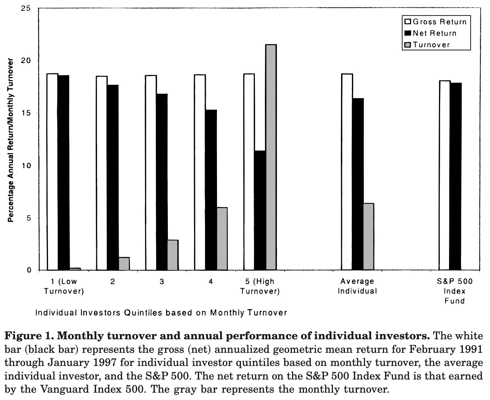

# 4.3 Investment

Basic economic theory suggests that people invest to earn returns to maximise and smooth consumption. Given this basic objective, there are numerous "puzzles" present in the way that people actually behave.

## Low rates of stock market participation

Australia has one of the highest rates of share market participation in the world. In 2017, 37% of Australian adults held on-exchange investments. This level is a drop from over 50% in the early to mid-2000s, but above the 10% participation in many countries in Europe. Part of the reason for the high levels of Australian ownership is the large public offerings associated with the sale of public assets, including the Commonwealth Bank in 1991, Qantas in 1993 and Telstra in 1997.

Despite the relatively high level of Australian ownership, there is still a question why barely more than a third of Australians own shares. If the stock market is not correlated with other income sources, there is a benefit of diversification by owning some shares.

One rational explanation for low participation are costs such as acquiring information or opening a trading account. Even though these costs are small, the small financial wealth of most households means that their level of participation would also be small. However, these costs cannot be the only explanation, as many at the top of the wealth distribution also do not participate.

There are many behavioural explanations for non-participation. One is disappointment aversion, which is the tendency to make choices in a way that reduces the potential for future expected disappointment. (Disappointment is closely tied to and often an alternative name for "regret" in the behavioural literature.) Disappointment occurs when an outcome falls short of the person's reference point, such as the expected utility of the lottery or the certainty equivalent. Someone who is disappointment averse will be less attracted to a gamble that an expected utility maximiser due to that potential disappointment. Stock market participation, obviously, provides an opportunity for disappointment.

Loss aversion could provide another potential behavioural explanation, but it is inadequate to explain the rejection of small, favourable stock market investments. As a result, loss aversion is often combined with narrow framing. Narrow framing occurs where people evaluate gambles in isolation. They do not place the gamble in the context of other gambles they are taking. But combined with a narrow frame, whereby they don't consider their full basket of risks, the potential for loss becomes clear.

There is also a link between stock market participation and knowledge. Those with more schooling, higher IQ or higher financial literacy are more likely to participate in the stock market.

Finally, an assessment that more people should participate in the stock market has an implicit assumption that people will participate optimally, such as by buying a diversified portfolio. However, there is a risk that if they did invest in the stock market, they would exhibit many of the problems identified on this page, including a lack of diversification and overtrading. In practice, it might be better if some households stayed out. That is the topic of the next tab.

## Under-diversification

Those who invest in shares often hold an undiversified portfolio. The median US household holds only two stocks directly. We also disproportionately hold stocks from our own country, with only 8% of Australians directly holding foreign shares.

There is some evidence that those with undiversified portfolios earn outsize returns, due to factors such an information advantage. Even if this was the case, however, that outsize return comes with increased risk, and it is not clear that the higher return compensates for the greater risk.

As you will recall, one of the questions in the basic financial literacy questionnaire concerns diversification. Lower financial literacy is linked to lower diversification.

Even when we do diversify, we often use crude metrics such as the 1/n rule, in which investments are simply spread across options in equal proportions. This means that if more shares are offered in a menu of options, we will end up with a great proportion of shares in our portfolio.

But is this irrational? The following story about a pioneer of modern portfolio theory raises some questions.

> Harry Markowitz won a 1990 Nobel Prize in economics for efficiently passing the buck — make that bucks. He was honored for developing a mathematical formula that helps investors maximize profit and minimize loss in their portfolios. After an exhaustive analysis of financial information, Markowitz’s procedure allocates a per- son’s stash of cash to an array of assets, with more money going to better bets.
>
>Many banks rely on this or similar investment approaches, warning customers to avoid picking investments intuitively. Yet Markowitz, now at the University of California, San Diego, followed a hunch in 1952 when he split paycheck contributions to his retirement account equally between stocks and bonds.
>
>Economists call this simple approach “1 over N,” distributing money evenly among the number of available investment options, the Ns. The 1/N strategy is also called “naïve diversification,” a presumably second-rate alternative to crunching the numbers and calculating gain and loss probabilities for each potential investment. Nonetheless, many people with stock-and-bond retirement accounts opt for an even split.
>
>As a young economist, Markowitz just wanted to avoid future regrets about fouling up his nest egg. “I thought, ‘You know, if the stock market goes way up and I’m not in it, I’ll feel stupid. And if it goes way down and I’m in it, I’ll feel stupid,’ ” he recalls. “So I went 50–50.”

Markowitz did not following the optimal behaviour as defined by himself. Was Markowitz erring?

[FEEDBACK AFTER ANSWERING QUESTION]

Gerd Gigerenzer argues that optimisation is not always the best solution. Where a problem is computationally intractable or the optimisation solution lacks robustness due to estimation errors, heuristics may outperform. Gigerenzer notes work showing that 500 years of data would have been required for Markowitz’s optimisation rule to outperform his practice of 1/N. Markowitz was using a simple heuristic for an important decision, but rightfully so as it was superior for the environment in which he is making the decision.

## Poor trading performance

>**D**
>
>DAY-TRADER, n. See IDIOT
>
>**I**
>
>IDIOT, n. See DAY_TRADER
>
>*Jason Zweig, The Devil's Financial Dictionary*

On average, the more people trade, the worse they perform. This is driven largely, but not solely, by transactions costs. 

Those who believe they are better than others (overplace) trade more. There is mixed evidence in support of a link between overprecision and over-trading.

There is also a difference by gender. Men trade more than women, and suffer a larger trading penalty as a result.

## Poor investment options

One cheap, easy option to achieve stock market diversification is a low-cost managed fund. However, people hold individual stocks more often than you would expect given the diversification benefits of a fund. Then when they choose funds, they often choose actively managed funds,which typically underperform passively managed funds. And of those they choose, they pay high fees.

One rational explanation involves the broker or adviser. Funds tend to flow to funds with higher commissions, suggesting the broker is acting in their own interest. Conflicted remuneration has been severely curtailed in Australia in recent years, and low-cost index funds have become increasingly available. This change may influence the proportion of funds in high-fee funds in the future.

There is some evidence that financial illiteracy is a cause of poor fund choice. High-IQ investors choose cheaper funds. But even when clear fee information is given to an ostensibly bright group (Harvard and Wharton students and staff) with which to choose between four index funds, many fail to minimise fees. This failure suggests a lack of financial sophistication even among that group.

## Optional reading

Bower (2011) "Simple heresy - Rules of thumb challenge complex financial analyses", *Science News*, 179(12), 26-29, https://doi.org/10.1002/scin.5591791221 (You can access *Science News* online in the UTS library.)

## References

Ang et al. (2005) "Why Stocks may Disappoint", *Journal of Financial Economics*, 76(3), 471-508, https://doi.org/10.1016/j.jfineco.2004.03.009

Barber and O'Dean (2000) Trading Is Hazardous to Your Wealth: The Common Stock Investment Performance of Individual Investors, *Journal of Finance*, 55(2), 773-806, https://doi.org/10.1111/0022-1082.00226

Barber and O'Dean (2001) "Boys will be Boys: Gender, Overconfidence, and Common Stock Investment", *The Quarterly Journal of Economics*, 116(1), 261-292, https://doi.org/10.1162/003355301556400

Choi et al (2009) "Why Does the Law of One Price Fail? An Experiment on Index Mutual Funds", *The Review of Financial Studies*, 23(4), 1405-1432, https://doi.org/10.1093/rfs/hhp097

Deloitte Access Economics (2017) *ASX Australian Investor Study 2017*, https://www.asx.com.au/documents/resources/2017-asx-investor-study.pdf

O'Dean (1999) "Do Investors Trade Too Much", *The American Economic Review*, 89(5), 1279-1298, https://doi.org/10.1257/aer.89.5.1279

Jason Zweig (2015) *The Devil's Financial Dictionary*, Public Affairs