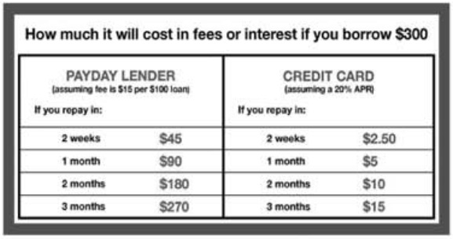
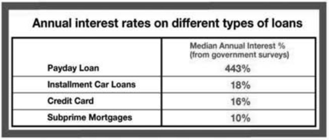
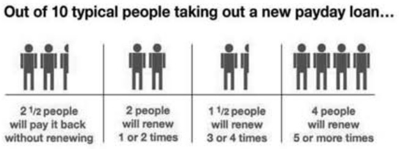
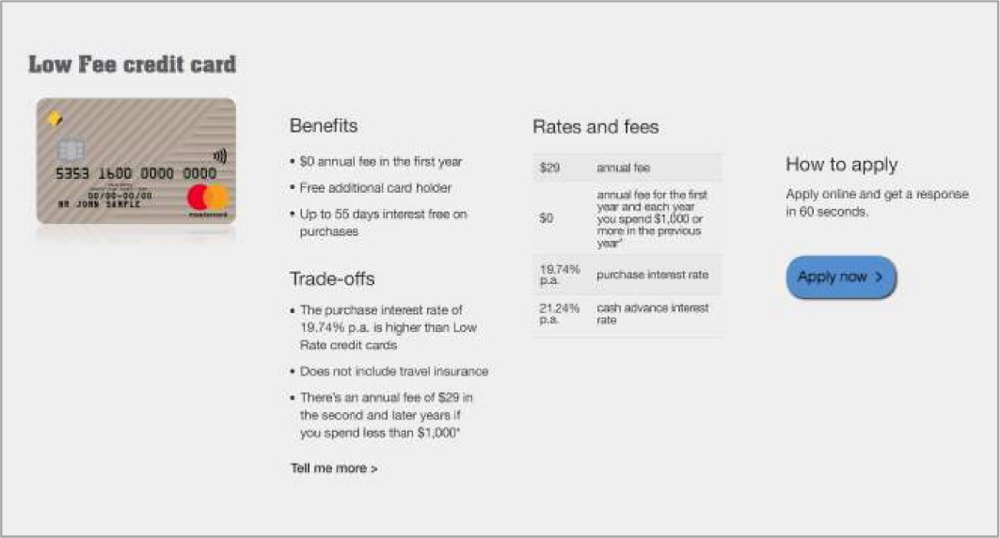

# 5.4 Product distribution - information

The way in which information is provided through the distribution and sales process can markedly change customer outcomes.

## Marketing and advertising

The most salient way in which this occurs is marketing and advertising. As one example, research by Hastings and colleagues (2017) into the privatised Mexican social security system found that marketing raises demand for financial products, and lowers the price elasticity of demand (low elasticity means price goes up, but demand doesn't go down). This enabled the system to have fees so high that the average fee would reduce a 100 peso deposit to 95 pesos five years later even when the investments earned a 5% annual return.

Similarly, research into the US mortgage market found that lenders sell more expensive mortgages in regions where they advertise more.

Part of the way in which these negative effects occur is that firms make appealing attributes salient, and shroud fee and quality problems. Customers don't seem to infer that what is hidden is bad news. For instance, UK research by Armstrong and Vickers (2012) found that a small cohort of bank customers often suffer repeated "unexpected" overdraft charges. These fees were easily found after a few clicks on the bank's website, but were effectively hidden relative to other features of the accounts.

This leads to an obvious intervention of ensuring advertising covers more than just the positive attributes of a product, possibly enabling a better decision. Are the long-term interest rates advertised with the same salience as the honeymoon rate? However, if a product is poorly designed (e.g. excessive fees), there is no way to fix this through marketing.

## Disclosure in payday lending

Marianne Bertrand and Adair Morse (2011) trialled information disclosure in a field experiment in payday lending stores in the United States. They included one of the following three designs on the loan documentation envelopes.

#### Dollar information

One treatment provided the customer with dollar information on accumulated fees over time, compared with same amount on credit card.

Customers who received this treatment were 5.9 percentage points less likely to borrow in the pay cycle following the intervention (an 11% decline relative to the control group). They also reduced the amount borrowed if they did return by 23%. The success of this intervention suggests an initial lack of understanding of the power of compounding (financial literacy).

#### Comparison of annual percentage rates

Although regulation already required lenders to provide an annualised percentage rate to customers, this treatment involved comparison of the annualised percentage rate of the payday loan with other financial instruments that the customers are likely familiar with.

Customers who were provided with the annual percentage rate comparisons reduced the amount borrowed for future loans by 16%. (There was no effect on likelihood of taking out a loan.)

#### Typical repayment profile

The third treatment provided information on the typical repayment profile for a customer.

Customers provided with the typical repayment profile reduced future sums borrowed by 12%. (There was no effect on likelihood of taking out a loan.) This change might be because the information reduced the overoptimism of the borrower as to their future actions and financial situation .

## Credit card transparency

A large nationwide retail bank showed the trade-offs associated with credit cards at the beginning of the sale process. Monthly spending by those who saw the trade-offs was 10% higher, with 20% lower cancellation rates and 10% fewer late payments.

It is not clear exactly how the transparency measure worked, but may be due to both selection effects (people got cards more suited to their needs) or an education effect (they used the card better).

## Distributing the bonus saver account

You weren't able to convince the product owner or pricing team that they should remove the criteria on the bonus saver account. What measures could you introduce during the sales process to increase the proportion of customers who appropriately select the product?

[ADD QUESTION]

## References

Armstrong and Vickers (2012) "Consumer Protection and Contingent Charges", *Journal of Economic Literature*, 50(2), 477-493, http://doi.org/10.1257/jel.50.2.477

Bertrand and Morse (2011) "Information Disclosure, Cognitive Biases,and Payday Borrowing", *The Journal of Finance*, 66(6), 1865-1893, https://doi.org/10.1111/j.1540-6261.2011.01698.x

Buell and Choi (2019) "Improving Customer Compatibility with Operational Transparency", *Harvard Business School Working Paper*, No. 20-013, July 2019, https://www.hbs.edu/faculty/Pages/item.aspx?num=56465

Gurun et al (2016) "Advertising Expensive Mortgages", *The Journal of Finance*, 71(5), https://doi.org/10.1111/jofi.12423

Hastings et al (2017) "Sales Force and Competition in Financial Product Markets: The Case of Mexico's Social Security Privatization", *Econometrica*, 85(6), 1723-1761, https://doi.org/10.3982/ECTA12302